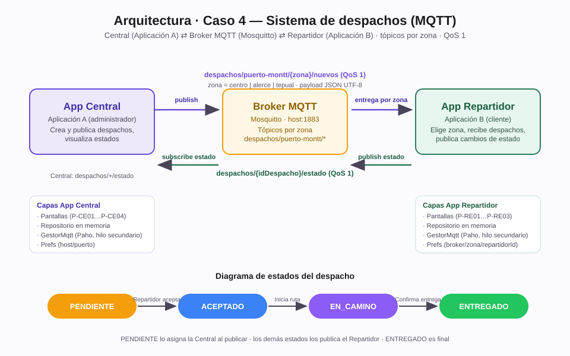
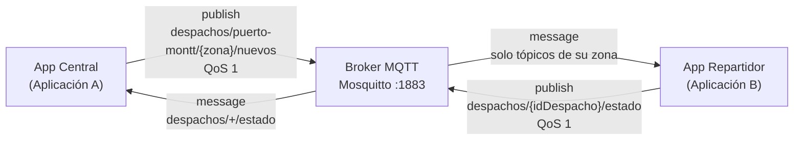
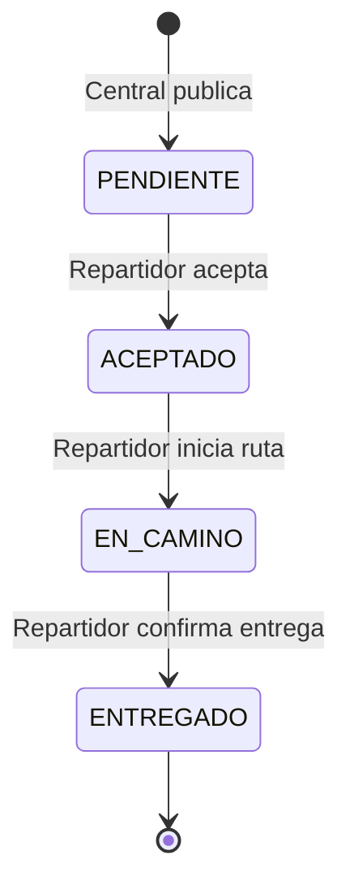

# Caso 4 — Sistema de despachos: Central y Repartidor (MQTT)

Proyecto de dos aplicaciones **Android independientes** que se comunican mediante **MQTT**
(broker Mosquitto + Eclipse Paho), según la especificación del *Caso 4*:

- **Aplicación A — Central de despacho** (administrador): crea y publica solicitudes de
  despacho por zona, mantiene un listado local y visualiza los cambios de estado que
  reportan los repartidores.
- **Aplicación B — Repartidor** (cliente): selecciona su zona de trabajo, recibe en tiempo
  real los despachos de esa zona, acepta entregas y publica el avance de estados.

| Aplicación A | Central de despacho |
|---|---|
| **Aplicación B** | Repartidor |
| **Tecnología obligatoria** | MQTT (broker + tópicos, patrón publicar/suscribir) |
| **Tópicos de zona** | `despachos/puerto-montt/{zona}/nuevos` (centro, alerce, tepual) |
| **Tópico de estados** | `despachos/{idDespacho}/estado` |
| **QoS** | 1 en despachos y en actualizaciones de estado |

---

## 1. Diagrama de arquitectura



Versión Mermaid (renderizable en GitHub):





**Justificación de MQTT:** el patrón publicación/suscripción desacopla emisor y receptor.
La Central publica en una zona sin conocer qué repartidores están conectados; cada
repartidor solo recibe los mensajes del tópico de su zona. QoS 1 garantiza entrega al
menos una vez.

---

## 2. Estructura del repositorio

```
Projecto android 2/
├── central/          ← Proyecto Android Studio de la App A (Central de despacho)
├── repartidor/       ← Proyecto Android Studio de la App B (Repartidor)
├── apk/              ← APKs listos para instalar (debug, firmados)
│   ├── central-depacho-v1.0-debug.apk
│   └── repartidor-v1.0-debug.apk
├── docs/
│   ├── diagrama-arquitectura.svg   ← Diagrama de arquitectura
│   ├── contrato-datos.md           ← Tópicos, payloads y estados
│   └── demo.md                     ← Checklist de demostración
└── README.md
```

Cada proyecto Android es independiente y tiene la misma organización:

```
central/
├── settings.gradle · build.gradle · gradle.properties · local.properties (sdk.dir)
└── app/src/main/
    ├── AndroidManifest.xml            (permiso INTERNET)
    ├── java/com/proyecto/despachos/central/
    │   ├── MainActivity.java          ← P-CE01 conexión (host/puerto + indicador)
    │   ├── NuevoDespachoActivity.java ← P-CE02 formulario (validación ERR-02)
    │   ├── ListaDespachosActivity.java← P-CE03 listado con filtro por estado
    │   ├── DetalleDespachoActivity.java← P-CE04 detalle con historial
    │   ├── mqtt/GestorMqtt.java       ← capa MQTT separada de la UI (RNF-04)
    │   ├── datos/Repositorio.java     ← listado local en memoria (RF-05)
    │   ├── modelo/Despacho.java       ← entidad + serialización JSON UTF-8
    │   ├── modelo/Estado.java         ← máquina de estados
    │   ├── ui/DespachoAdapter.java    ← RecyclerView (RF-13 colores por estado)
    │   └── util/Prefs.java            ← configuración en SharedPreferences (RNF-06)
    └── res/ (layouts en español, colores por estado, íconos)
```

En `repartidor/` la organización es equivalente: `ConexionActivity` (P-RE01),
`ListaDespachosActivity` (P-RE02), `DetalleDespachoActivity` (P-RE03) más las mismas
capas `mqtt/`, `datos/`, `modelo/`, `ui/` y `util/`.

**Navegación con el botón Atrás:** en ambas aplicaciones el botón de retroceso
(hardware/gesto) lleva siempre al **menú principal** de la app, desde cualquier
pantalla (formulario, listado o detalle). Se implementa sobrescribiendo
`onBackPressed()` en las pantallas secundarias y volviendo con
`FLAG_ACTIVITY_CLEAR_TOP | FLAG_ACTIVITY_SINGLE_TOP`. En la Central devuelve a
P-CE01; en el Repartidor devuelve a P-RE01.

---

## 3. Requisitos principales implementados

| ID | Requisito | Dónde se cumple |
|---|---|---|
| RF-01 | Dos apps Android independientes | carpetas `central/` y `repartidor/` con applicationId distintos |
| RF-02 | Ambas se conectan al mismo broker (host:puerto configurables) | `Prefs` + campo en P-CE01 / P-RE01 |
| RF-03 | Central crea despacho (id, destino, descripción, zona) | `NuevoDespachoActivity` |
| RF-04 | Publicación en `despachos/{zona}/nuevos` | `GestorMqtt.publicar` QoS 1 |
| RF-05 | Listado local en Central | `Repositorio` + `ListaDespachosActivity` |
| RF-06 | Central suscrita a `despachos/+/estado` | `MainActivity.conectar()` |
| RF-07 | Repartidor elige zona (Z01 Centro / Z02 Alerce / Z03 Tepual) | spinner P-RE01 |
| RF-08 | Repartidor suscrito a `despachos/{zona}/nuevos` | `ConexionActivity.conectar()` |
| RF-09 | Listado dinámico en Repartidor (sin refrescar) | `Repositorio` notifica → RecyclerView |
| RF-10 | Detalle con id, destino, descripción, zona, estado | P-CE04 / P-RE03 |
| RF-11 | Aceptar → publica ACEPTADO en `despachos/{id}/estado` | `DetalleDespachoActivity.avanzarEstado()` |
| RF-12 | Secuencia obligatoria PENDIENTE→ACEPTADO→EN_CAMINO→ENTREGADO | `Estado.siguiente()` + validación |
| RF-13 | Estados distinguidos por color | `DespachoAdapter.colorEstado` |
| RF-14 | Validación de campos vacíos | ERR-02 en formulario |
| RF-15 | Un solo repartidor acepta (ERR-06) | repartidor suscrito a estados + validación local |
| RF-16 | Retroalimentación visual (Toast) tras cada acción | todas las pantallas |
| RF-17 | Indicador de conexión en ambas apps | P-CE01 / P-RE01 |

**Requisitos no funcionales:** cliente Eclipse Paho 1.2.5 en hilo secundario (RNF-01,
sin ANR), QoS 1 explícito (RNF-02), payload JSON UTF-8 (RNF-03), capa MQTT separada de la
UI (RNF-04), interfaz en español (RNF-05), broker configurable en SharedPreferences
(RNF-06), reconexión automática con re-suscripción (RNF-07 / ERR-04 / FA-02 / FA-05).

**Errores cubiertos:** ERR-01 broker no disponible con reintento, ERR-02 campos vacíos,
ERR-03 sin zona seleccionada bloquea la suscripción, ERR-04 pérdida de conexión con
indicador y reconexión, ERR-05 JSON inválido ignorado con log, ERR-06 despacho ya
aceptado → "Despacho no disponible".

---

## 4. Cómo compilar en Android Studio

1. Abra Android Studio → **File ▸ Open** → carpeta `central/` (y luego `repartidor/`,
   cada una como proyecto propio). Gradle sincronizará automáticamente.
2. Si se solicita, en `File ▸ Settings ▸ Build Tools ▸ Gradle` use el *wrapper* incluido.
3. Ejecute `Run ▾ app` en un emulador o dispositivo.
4. O bien, desde terminal (Gradle 8.11.1, JDK 17, SDK Android 34):

```powershell
gradle -p central assembleDebug
gradle -p repartidor assembleDebug
```

Los APK quedan en `*/app/build/outputs/apk/debug/app-debug.apk` (copias listas en `apk/`).

---

## 5. Preparar el broker Mosquitto

Las apps se conectan a un **broker MQTT**; ninguna de las dos es el servidor.

**Windows:**
1. Instale Mosquitto (https://mosquitto.org/download) o use `winget install mosquitto`.
2. Edite `C:\Program Files\mosquitto\mosquitto.conf` y agregue:

```
listener 1883 0.0.0.0
allow_anonymous true
```

3. Inicie el broker: `mosquitto -c "C:\Program Files\mosquitto\mosquitto.conf" -v`
4. Permita el puerto 1883 en el firewall de Windows.
5. Obtenga la IP del PC (`ipconfig`, ej. `192.168.1.42`).

**Configuración en las apps** (RNF-06):

| Parámetro | Valor por defecto | Uso |
|---|---|---|
| Host | `10.0.2.2` | emulador apunta al PC; en dispositivo físico use la IP LAN del PC |
| Puerto | `1883` | puerto del listener de Mosquitto |
| Client ID | `central-{uuid}` / `repartidor-{uuid}` | único por conexión |
| Clean session | `true` | desarrollo; al reconectar se re-suscribe automáticamente |

**Verificación del broker** (opcional, con MQTT Explorer o CLI):

```powershell
# Escucha todos los tópicos del sistema
mosquitto_sub -h 127.0.0.1 -t "despachos/#" -v
```

**Opción B — broker incluido (Moquette, sin instalar nada):** el proyecto incluye un
broker MQTT en Java puro listo para la demo (carpeta `broker/`). Solo requiere JDK 17:

```powershell
# Compilar una vez (o usar el build ya incluido)
gradle -p broker installDist

# Ejecutar el broker (queda escuchando en 0.0.0.0:1883)
java -cp "broker\build\install\broker\lib\*" Broker

# Para detenerlo en forma controlada: cree el archivo broker\STOP
New-Item broker\STOP
```

Herramientas de prueba incluidas en el mismo proyecto:

```powershell
# Observar todo el tráfico del sistema (como MQTT Explorer por consola)
java -cp "broker\build\install\broker\lib\*" Espia

# Publicar un despacho de prueba desde el PC (por defecto zona centro)
java -cp "broker\build\install\broker\lib\*" PublicaPrueba centro DES-TEST-001
java -cp "broker\build\install\broker\lib\*" PublicaPrueba alerce DES-ALERCE-001   # FA-01: otra zona
```

> Nota: en este equipo el proyecto vive dentro de OneDrive; `app/build.gradle` de ambas
> apps redirige la carpeta de compilación a `%TEMP%` porque OneDrive bloquea los archivos
> intermedios de Gradle. Esa línea puede eliminarse si no se usa OneDrive.

---

## 6. Demo paso a paso (FP-01)

> **Esta demo fue ejecutada y verificada en su totalidad** en este PC (emulador Android 34
> con ambas apps instaladas + broker Moquette). Las capturas están en `docs/evidencia/`
> y la transcripción del tráfico MQTT en `docs/evidencia/trafico-mqtt-espia.txt`.

| # | Paso | Resultado obtenido | Evidencia |
|---|---|---|---|
| 1 | Central conecta al broker | "Conectado al broker" | `01-central-conectada.png` |
| 2 | Repartidor elige zona Centro y conecta | Listado "Despachos · zona centro" | `02-repartidor-conectado.png` |
| 3 | Central publica despacho (QoS 1) | DES-20260919-0457-263 publicado | `03-formulario-completo.png`, `03-despacho-publicado.png` |
| 4 | Repartidor recibe sin refrescar (RF-09) | Aparece "Pendiente" en su listado | `04-repartidor-recibe-despacho.png` |
| 5 | Aceptar despacho (RF-11) | ACEPTADO publicado; Central refleja | `05-despacho-aceptado.png` |
| 6 | Iniciar ruta (RF-12) | EN_CAMINO publicado | `06-despacho-en-camino.png` |
| 7 | Confirmar entrega | ENTREGADO publicado | `07-despacho-entregado.png` |
| 8 | Central muestra el ciclo completo (RF-06) | "Entregado" en la lista de la Central | `08-central-ciclo-completo.png` |
| 9 | ERR-02 campos vacíos | Formulario bloquea la publicación | `09-err02-campos-vacios.png` |
| 10 | ERR-01 broker apagado + reintento (FA-02/RNF-07) | "Desconectado" → "Conectado al broker" | `10-err01-broker-apagado.png`, `10-reintento-exitoso.png` |
| — | FA-01 zona equivocada | DES-ALERCE-001 no llega al repartidor de centro (verificado por tópico y UI) | `trafico-mqtt-espia.txt` |

Reproducir la demo automatizada:

```powershell
java -cp "broker\build\install\broker\lib\*" Broker        # broker en segundo plano/otra consola
# instalar los APK en un emulador o en dos dispositivos y luego:
powershell -ExecutionPolicy Bypass -File demo\pasos.ps1 -Paso 1   # hasta -Paso 10
```

1. Ejecute el broker Mosquitto.
2. Instale `central-depacho-v1.0-debug.apk` en el dispositivo A y `repartidor-v1.0-debug.apk`
   en el dispositivo B.
3. **Central**: escriba Host = IP del PC, puerto 1883 → **Conectar** → indicador verde.
4. **Repartidor**: mismo host, seleccione zona **Centro** → **Conectar y ver despachos**.
5. **Central**: *Nuevo despacho* → destino "Av. Colón 123", descripción "Paquete frágil,
   timbre 4B", zona **Centro** → **Publicar despacho**.
6. El despacho aparece en el listado del **Repartidor sin refrescar** (RF-09).
7. **Repartidor**: abra el detalle → **Aceptar despacho** → **Iniciar ruta** →
   **Confirmar entrega** (cada acción muestra un Toast y publica QoS 1).
8. **Central**: el listado refleja cada cambio con color (RF-06, RF-13): Pendiente →
   Aceptado → En camino → Entregado; el detalle muestra el historial.

Flujos alternativos que puede mostrar en la defensa:

- **FA-01** despacho en zona *Alerce* no llega al repartidor suscrito a *centro*.
- **FA-02 / ERR-01** apagar Mosquitto y pulsar Conectar → "No se pudo conectar al broker".
- **FA-03 / ERR-06** dos repartidores en la misma zona: el segundo ve "Despacho no disponible".
- **FA-05** cortar la red del repartidor: al volver, se re-suscribe y conserva su listado.

Checklist completo en [docs/demo.md](docs/demo.md) · Contrato de datos en
[docs/contrato-datos.md](docs/contrato-datos.md).

---

## 7. Respuestas rápidas para la defensa

1. **¿Qué tópico publica la Central y quién se suscribe?** `despachos/puerto-montt/{zona}/nuevos`
   (QoS 1); se suscribe cualquier repartidor de esa zona.
2. **¿Por qué un repartidor no recibe otra zona?** porque solo se suscribe a
   `despachos/puerto-montt/{suZona}/nuevos`; el broker filtra por tópico.
3. **¿Qué es QoS 1?** entrega al menos una vez con confirmación (PUBACK); se usa porque
   un despacho perdido es inaceptable y duplicar es tolerable (el repositorio ignora ids repetidos).
4. **¿Cómo sabe la Central que cambió el estado?** está suscrita al patrón
   `despachos/+/estado`; cada `+` es un id de despacho; al llegar el mensaje actualiza
   listado y detalle en tiempo real.
5. **¿Por qué MQTT y no Socket directo?** porque el broker desacopla (ambas apps pueden
   estar offline en momentos distintos, con QoS 1), da tópicos por zona (uno-a-muchos)
   y evita escribir un protocolo propio.
6. **¿Qué cambiaría con Firestore/RTDB?** ya no habría broker ni tópicos: las apps
   escribirían documentos/valores en Firebase y sincronizarían con listeners; la
   persistencia e historial serían de la nube y no en memoria local.

---

## 8. Tecnologías y versiones

- Java 17 · minSdk 24 · targetSdk/compileSdk 34 · AGP 8.7.3 · Gradle 8.11.1
- `org.eclipse.paho:org.eclipse.paho.client.mqttv3:1.2.5` (cliente MQTT en hilo secundario)
- AndroidX AppCompat 1.7.0 · Material Components 1.12.0 · RecyclerView 1.3.2
- JSON: `org.json` (incluido en Android) · Persistencia de configuración: `SharedPreferences`
